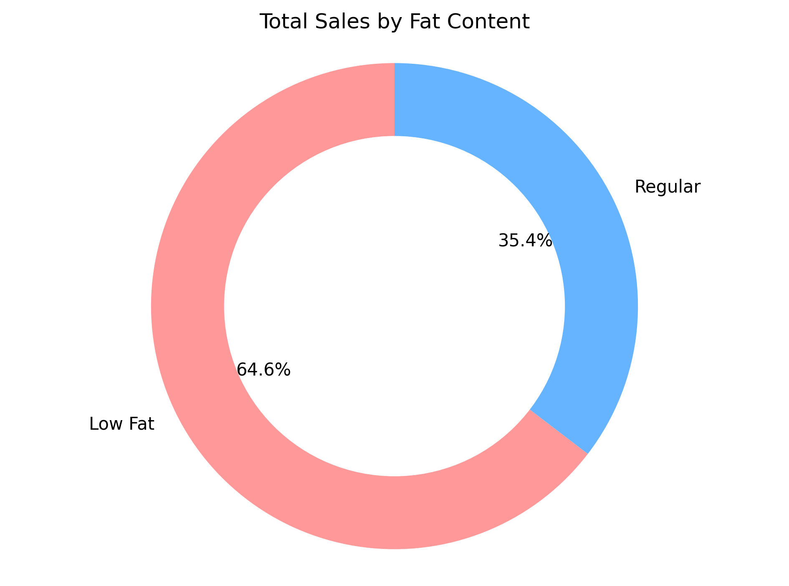
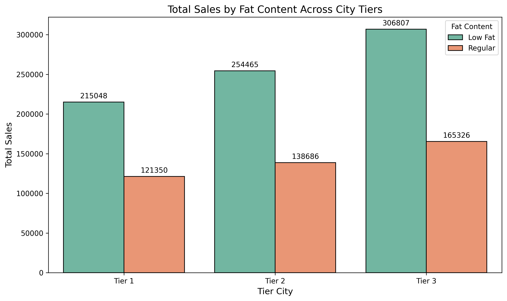
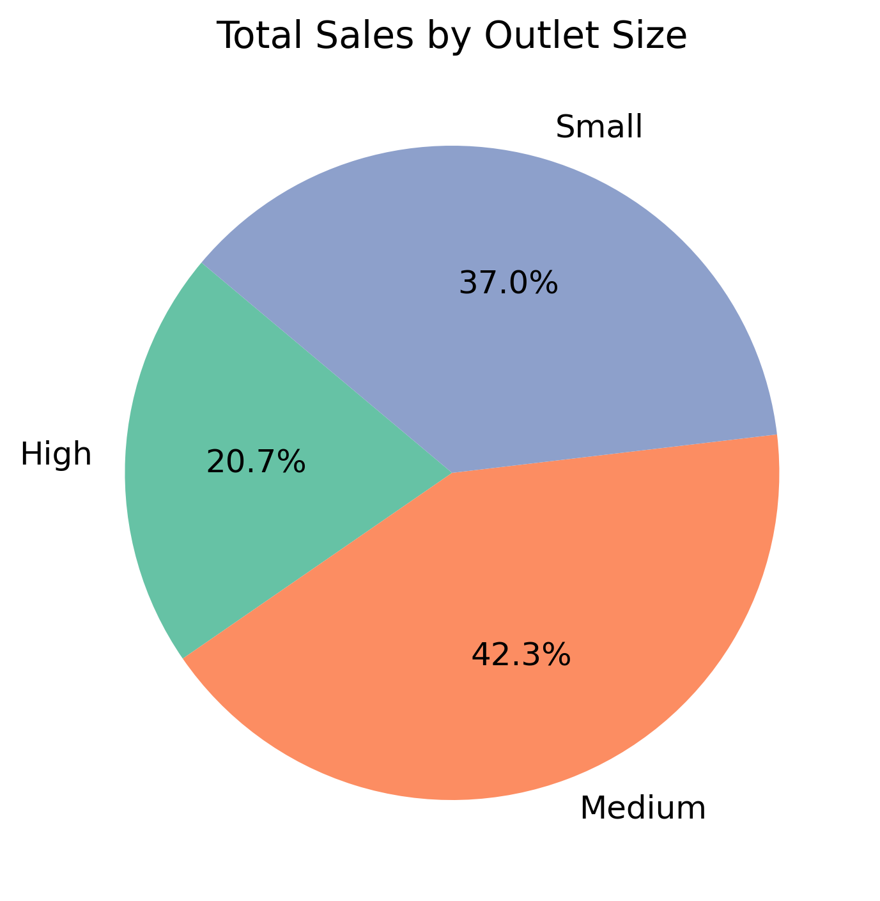
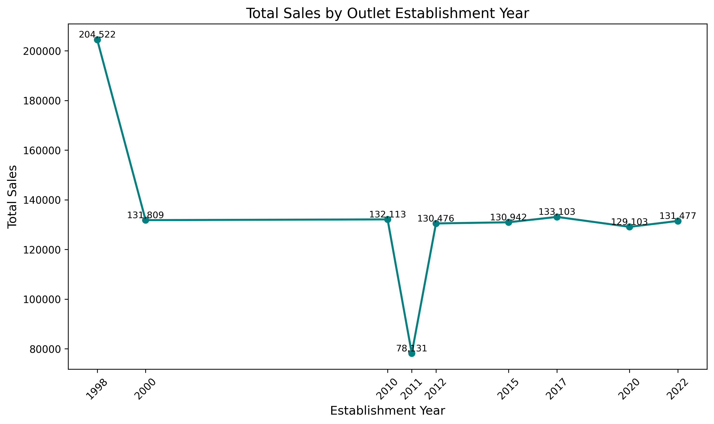
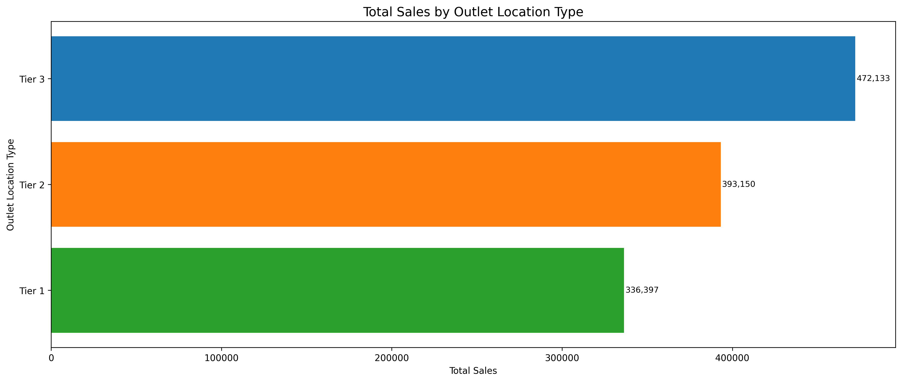

# Blinkit-Sales-Intelligence-End-to-End-EDA-KPI-Dashboard

📌 Project Overview
This project performs a full end-to-end data analysis pipeline on Blinkit's sales dataset (8,523 transactions, 12 features). The analysis identifies key revenue drivers, outlet performance patterns, and consumer preference trends — culminating in five business-aligned visualisations that answer concrete operational questions.

Why this matters: Blinkit operates across Tier 1–3 cities with outlets of varying size and vintage. Understanding which combination of location, outlet size, and product type drives the most revenue directly informs expansion strategy, inventory planning, and supplier negotiations.

🛠️ Tech Stack
Python Pandas NumPy Matplotlib Seaborn

📊 Key Metrics
MetricValueTotal Revenue$1,201,681Total Transactions8,523Avg Sale per Transaction$141Unique SKUs1,559Avg Customer Rating4.0 / 5.0

🔍 Key Findings

Fat content: Low Fat products drive 64.6% of revenue at identical margins — volume gap, not price
City tiers: Tier 3 cities generate the most revenue ($472K) — outperforming Tier 1 metros ($336K)
Outlet size: Medium outlets lead with 42.3% of sales, outperforming larger stores at just 20.7%
Top categories: Fruits & Vegetables ($178K) and Starchy Foods ($175K) together make up ~30% of revenue
Outlet vintage: 1998-established outlets generate $204K — 55% more than any other cohort

## 📊 Visualisations

### Total Sales by Fat Content

### Sales by City Tier

### Sales by Outlet Size

### Sales by Establishment Year

### Sales by Location Type

💡 Strategic Recommendations

Double down on Low Fat inventory — 64.6% revenue share with identical margins means shelf space reallocation is low-risk, high-reward.

Prioritise Tier 3 expansion — highest absolute revenue ($472K) and likely better unit economics than Tier 1 metro locations.

Audit 1998-vintage outlets — they generate ~55% more revenue than the average. Replicate their format, location, or SKU mix in new openings.

Investigate Medium format further — outperforms Large stores at 42.3% share; consider it the default expansion format.

Rationalise Seafood & Breakfast SKUs — combined $24K revenue on likely non-trivial shelf space; consider reducing assortment

